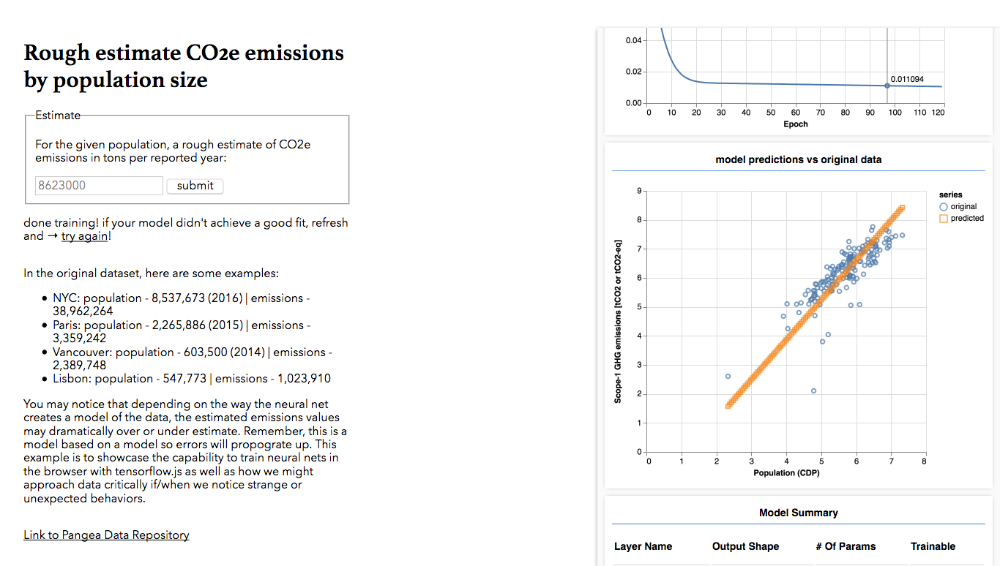
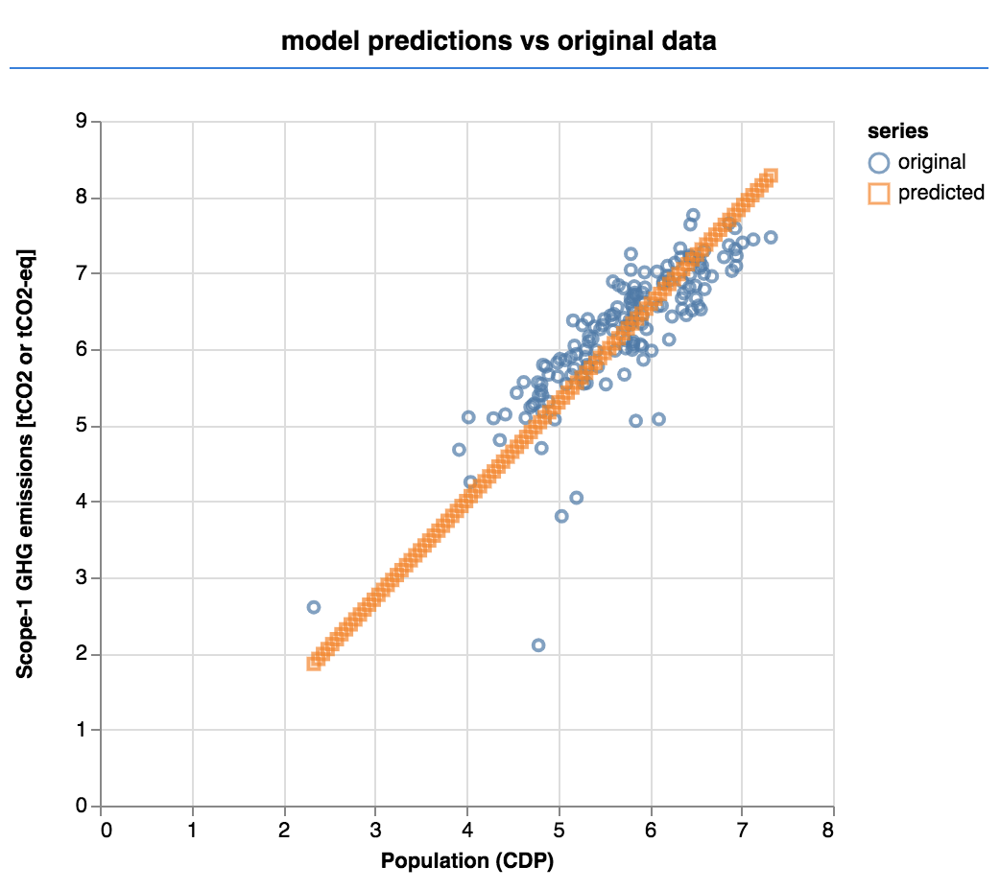
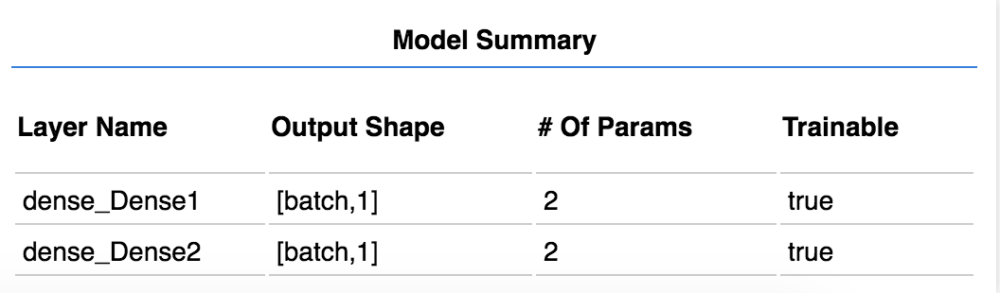
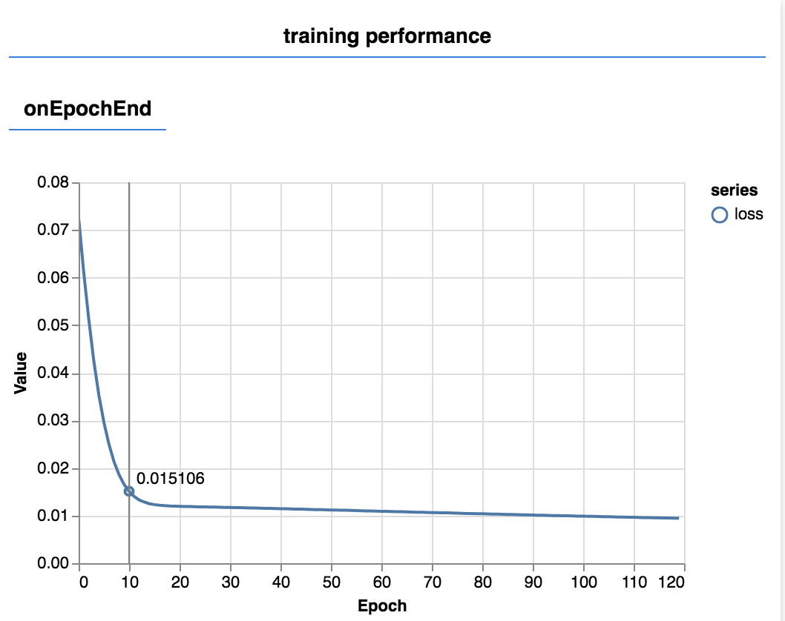
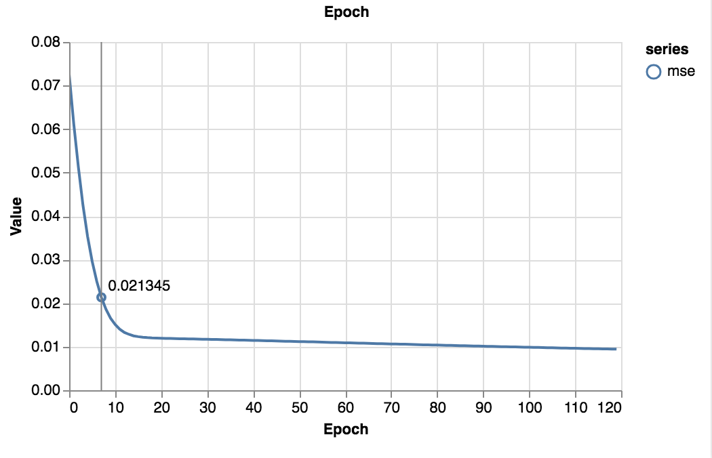
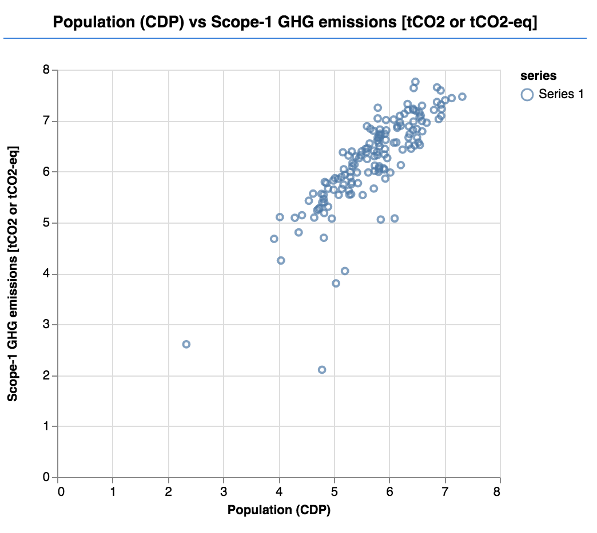

# co2net

Data found via [Data is Plural](https://tinyletter.com/data-is-plural)

NOTE: City Population and CO2 Emissions have been log scaled during model training. Therefore you should Math.log10() any input to the model when running predictions.

## Methods: 
* there are ~340+ cities in the reported paper, but it seems only ~150 do not contain `null` values for `'Population (CDP)'` or `'Scope-1 GHG emissions [tCO2 or tCO2-eq]'` which are used as the `x` and `y` values. Null or undefined values are filtered out.
* The model is run a number of times to achieve optimal fit based on visual inspection using tfvis. The model in the `/output` folder reflects these images:

* **Input**: Population Size as `Math.log10( populationSizeOfInterest )`
* **Output**: CO2 Equivalent Emissions in tons. To get the CO2e in tons use `Math.pow(10, outputNumber)`

`/output`:
* contains `co2net.json` and `co2net.weights.bin` - pretrained model

`/issues`:
* Screenshot of potential issues in the data. E.g. Faro in Portugal has a population size of 61k but low co2 emissions - needs investigation? 

Data and Paper:
* https://www.nature.com/articles/sdata2018280?WT.ec_id=SDATA-201901
* https://doi.pangaea.de/10.1594/PANGAEA.884141
* https://data.cdp.net/Emissions/2016-Citywide-GHG-Emissions/dfed-thx7
* https://carbonn.org/

 
